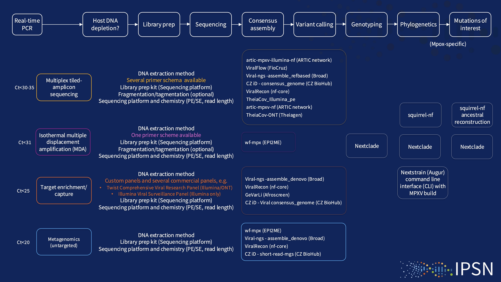

 

In an effort to help countries navigate the many options available in terms of both wet-lab and dry-lab approaches to MPXV genomics the Better Tools and Standards workstream have begun to collate a landscape analysis of the current methods.

We welcome updates either through pull-requests or via issues to this repository.
### Community curated landscape of MPXV genomics

#### Primer Schemes 

For multiplex tiled-amplicon sequencing several primer schemes have developed.  These primer schemes are agnostic of the downstream sequencing platform although platform specific pre-processing (e.g. fragmentation) maybe required.

Primer schemes are designed against single or multiple references.  For MPXV, the current primer schemes have utilised a IIb clade reference sequence.  For the recent emergence of clade Ib, evidence is developing of the utility of these schemes for MPXV sequencing of Ib genomes (see table below).

| Primer Scheme​                     | Amplicon size (bp)​ | No. primers​ | Clade reference​   | Works with clade Ib?​                                                                             | Protocol or repo​                                                                                        | Citation​                                       |
| ---------------------------------- | ------------------- | ------------ | ------------------ | ------------------------------------------------------------------------------------------------- | -------------------------------------------------------------------------------------------------------- | ----------------------------------------------- |
| Brinkmann 2024​                    | 375​                | 682​         | IIb (ON585033.1)​  | ​                                                                                                 | ​                                                                                                        | https://doi.org/10.1016/j.jviromet.2024.114888​ |
| Yale​                              | 2000​               | 326​         | IIb (MT903345)​    | [>85% Coverage](https://artic.network/mpxv/artic-mpxv-guide.html)​                                | https://dx.doi.org/10.17504/protocols.io.5qpvob1nbl4o/v4​                                                | https://doi.org/10.1371/journal.pbio.3002151    |
| INRB​                              | 2000​               | 326​         | IIb (MT903345)​    | ​                                                                                                 | https://github.com/inrb-labgenpath/DRC_MPXV_primers​                                                     | ​                                               |
| Welkers (Erasmus /Rigshospitalet)​ | 2500​               | 176​         | IIb (ON563414.3)​  | [>90% Coverage](https://www.eurosurveillance.org/content/10.2807/1560-7917.ES.2024.29.11.2400106) | https://www.protocols.io/view/monkeypox-virus-whole-genome-sequencing-using-comb-n2bvj6155lk5/v1?step=1​ | ​                                               |
| ARTIC / BCCDC​                     | 3000​               | 155​         | IIb (AY753185.1)​  | ​                                                                                                 | [https://github.com/quick-lab/MPXV](https://github.com/quick-lab/MPXV)​                                  | ​                                               |
| Bosmeny 2023​                      | 3000​               | 141​         | IIb (NC_063383.1)​ | ​                                                                                                 | https://github.com/gagnonlab/artic-mpxv​                                                                 | http://dx.doi.org/10.1186/s12985-023-02059-2​   |
| Isabel 2023​                       | 5000​               | 98​          | IIb (ON563414.3)​  | ​                                                                                                 |                                                                                                          | https://doi.org/10.1128/spectrum.02979-23       |
| Licheri 2024​                      | varies​             | 6+1​         | IIb (ON792320.1)​  | in silico​                                                                                        | ​                                                                                                        | https://doi.org/10.21203/rs.3.rs-4024102/v1     |

Adapted from https://artic.network/mpxv/resources

#### Bioinformatic workflows for consensus generation from amplicon sequencing

The generation of an MPXV consensus sequence from a tiled-amplicon sequencing run requires multiple bioinformatic steps including filtering and trimming of host and primer sequences, mapping reads to the appropriate reference genome and identifying variants in the new sequence.  There are many options for end-to-end workflows that perform these individual steps supporting different sequencing platforms.  These pipelines generally utilize a workflow management system (i.e. Nextflow / WDL) that facilitate the integration of these diverse tools and containerization to enable deployment across different platforms and environments.  Despite the wide choice of workflows listed below we can see that many of the tools, while sequencing platform specific, are shared across different implementations.  

| **Pipeline**                                                                      | **Sequencing Platform**      | **Workflow Language** | **Containerized**    | **Host Removal**        | **Trimming**        | **Primer Removal** | **Reference Mapping** | **Variant Calling**        | **MSA** | **Annotation** |
| --------------------------------------------------------------------------------- | ---------------------------- | --------------------- | -------------------- | ----------------------- | ------------------- | ------------------ | --------------------- | -------------------------- | ------- | -------------- |
| [artic-mpxv-nf](https://github.com/artic-network/artic-mpxv-nf)                   | ONT                          | Nextflow              | Docker (Epi2Me)      | artic                   | artic guppyplex     | artic minion       | artic minion          | artic minion               | -       | -              |
| [TheiaCoV](https://github.com/theiagen/public_health_viral_genomics)              | ONT                          | WDL                   | Docker / Singularity | NCBI SRA Human Scrubber | artic guppyplex     | artic minion       | artic minion          | artic minion               | -       | -              |
| [ViralRecon - ONT](https://github.com/nf-core/viralrecon)                         | ONT                          | Nextflow              | Docker / Singularity | -                       | artic guppyplex     | artic minion       | artic minion          | artic minion               |         | SnpEff         |
| [Cecret](https://github.com/UPHL-BioNGS/Cecret)                                   | Illumina / ONT               | Nextflow              | Docker / Singularity | -                       | fastp / segyclean   | ivar               | bwa / minmap2         | ivar / samtools / bcftools | Mafft   | Vadr           |
| [Viral ngs (assemble_refbased)](https://github.com/broadinstitute/viral-ngs)      | Illumina / ONT / PacBio      | WDL                   | Docker               | -                       |                     | ivar               | minimap2              |                            | -       | -              |
| [artic-mpxv-illumina-nf](https://github.com/artic-network/artic-mpxv-illumina-nf) | Illumina                     | Nextflow              | Docker (Epi2Me)      | Hostile                 | trim-galore         | ivar               | bwa                   | Freebayes                  | Mafft   |                |
| [TheiaCoV_Illumina_PE](https://github.com/theiagen/public_health_viral_genomics)  | Illumina                     | WDL                   | Docker / Singularity | Kraken2                 | trimmomatic / bbduk | ivar               | bwa                   | ivar / samtools / bcftools | -       | -              |
| [Viral Flow](https://github.com/theiagen/public_health_viral_genomics)            | Illumina                     | Nextflow              | No                   | -                       | fastp / samtools    | fastp              | bwa                   | ivar / samtools / bcftools | mafft   | SnpEff         |
| [CZ ID viral consensus genome](https://czid.org/)                                 | Illumina                     | WDL                   | No - SaaS            | minimap2                | trim-galore         | ivar               | minimap2              | ivar / samtools / bcftools | -       | -              |
| [GeVarLi](https://forge.ird.fr/transvihmi/nfernandez/GeVarLi)                     | Illumina                     | Snakemake             | No                   | -                       | cutadapt/sickle     | bamclipper         | bwa/minimap2/bowtie2  | ivar / samtools / bcftools | -       | -              |
| [ViralRecon - illumina](https://github.com/nf-core/viralrecon)                    | Illumina                     | Nextflow              | Docker / Singularity | Kraken2                 | fastp               | ivar               | bowtie2               | ivar / samtools / bcftools | -       | SnpEff         |
| [Viridian](https://github.com/iqbal-lab-org/viridian)                             | Illumina / ONT / Ion Torrent | N/A                   | Docker / Singularity | -                       |                     |                    | minimap2              | cyclon                     | maft    | -              |
| [Polkapox](https://github.com/CDCgov/polkapox)                                    | Illumina                     | Nextflow              | Docker / Singularity | Kraken2                 | fastp               | ivar               | bwa                   | ivar / samtools / bcftools | -       | -              |
#### Consensus Sequencing Post-Processing

The MPXV genome has certain features that need to be considered when generating a consensus sequence to ensure that erroneous variation is not incorporated.  These include both large inverted repeats and short tandem repeats whose copy number is difficult to ascertain, deletions and rearrangements in the genome, and an overall low GC content.  To mitigate the uncertainty of variant calling in these regions, strategies that mask regions of the genome have been incorporated into software such as [NextStrain](https://github.com/nextstrain/mpox/tree/master) or [squirrel](https://github.com/aineniamh/squirrel) to aid accurate phylogenetic construction.  To enable researchers to share regions of the genome that appear problematic, we have created a [repository](https://github.com/WHO-Collaboratory/collaboratory-mpox-genomics-phylomasking) to catalogue these positions, translated to multiple reference coordinates, for use in phylogenetic inference. 